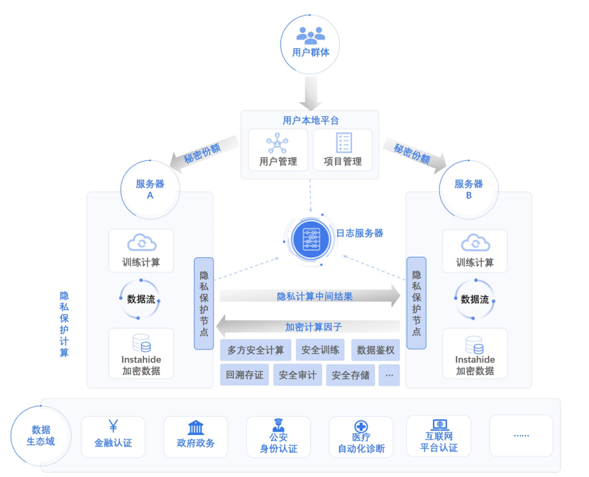
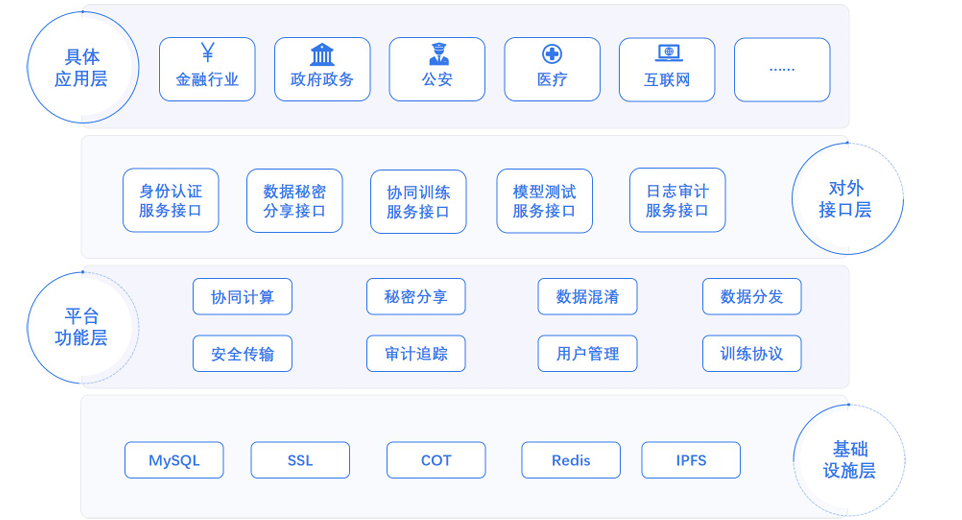
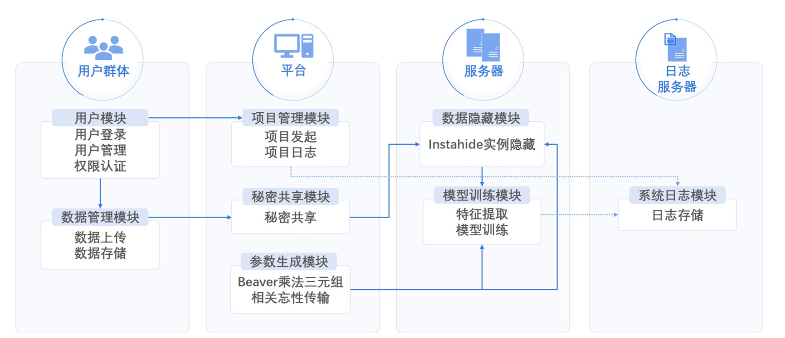

# 项目引入

## 💡项目概述：

IMGuard是基于双服务器的图像数据隐藏训练系统，采用InstaHide 实例隐藏加密技术和神经网络训练框架。应用于金融身份认证，医疗影像保护和法律证据保护等涉及到敏感信息的高风险场景，致力于保障图像隐私数据的安全共享与高效利用。


## 💡社会背景：

人脸识别技术在身份验证、线下支付、智慧网点等场景中被大量使用，但通过攻击平台以牟利的黑灰产也应运而生，不法分子利用盗取的人脸数据，绕过前端活体检测模块，对人脸识别系统发起精准攻击，造成了大量的安全事故与财产损失，保护人脸图片安全已成为数据隐私保护的重中之重。远程医疗行业也面临严峻的隐私挑战，大量涉及个人隐私的医学图像正通过各类平台进行传输、存储和分析。据德国某网络安全机构披露，目前网络上可访问的医学图像已达数十亿张，极大地威胁了患者隐私和国家医疗数据安全。

在上述背景下，急需一套能兼顾训练效果与图像隐私保护的技术体系，解决“既要让数据参与智能模型训练，又不能泄露原始图像内容”的技术难题。


## 💡研究意义：

《公共安全视频图像信息系统管理条例》：该条例于 2024 年 12 月 16 日国务院第 48 次常务会议通过，自 2025 年 4 月 1 日起施行。条例明确指出，国家鼓励和支持视频图像领域的技术创新与发展，建立和完善相关标准体系，支持有关行业组织依法加强行业自律，提高公共安全保障能力和个人信息保护水平。


## 💡行业挑战：

在神经网络训练场景中，常规训练系统仍存在严重安全隐患：

·恶意攻击者可通过训练结果或梯度参数反向恢复原始数据

·半诚信行为模型下数据用户间难以协同训练


## 💡创新与价值：

我们的系统利用InstaHide 实例隐藏技术和双服务器协同神经网络训练框架，解决了现有的关键技术难题，为高敏感场景筑牢隐私保护防线。


# 系统设计

## 系统框架

本系统包含用户群体、用户本地平台、日志服务器和双服务器四个实体角色。双服务器负责数据隐藏加密与训练；日志服务器存储日志信息，记录相关计算和操作行为；用户本地平台提供项目和用户管理服务；用户群体拥有数据管理和最终模型的所有权。



 ## 系统框架图

用户可通过系统提供的离线插件上传图像数据的相关信息。数据不会在系统进行汇总，而是直接通过系统提供的接口以秘密份额的形式发布到两台服务器上，避免了用户图像数据的泄露。服务器进行准备工作，将之后需要使用的参数生成完全后，才开始数据隐藏与数据训练。其中数据隐藏与数据训练均基于系统的安全协议进行，保护用户数据的隐私性和安全性。



该系统体系结构分为四层。基础设施层包含 MySQL、SSL、COT、Redis、IPFS 等，为上层提供基础支撑；平台功能层涵盖协同计算、秘密分享、数据混淆、数据分发、安全传输、审计追踪、用户管理、训练协议等功能模块，实现系统核心处理逻辑；对外接口层有身份认证服务接口、数据秘密分享接口、协同训练服务接口、模型测试服务接口、日志审计服务接口，用于与外部交互；具体应用层面向金融行业、政府政务、公安、医疗、互联网等领域，将系统能力落地于实际场景。各层相互配合，下层支撑上层，共同构建起完整的系统体系。



 本系统支持本地部署

## 1.环境要求：

·操作系统：Linux / Windows / macOS（推荐 Linux 环境）

·Python ≥ 3.8

·Node.js ≥ 16.x（用于前端）

·pip、virtualenv（可选）

·git

 

## 2. 克隆项目或解压压缩包：

通过github下载

git clone https://github.com/JFSAS/IMGuard
解压源码压缩包

tar -xf 源码.zip -C 源码

## 3.安装依赖

### 后端依赖


```shell
cd backend
```
```shell
pip install -r requirements.txt
```
### 前端依赖

移动到frontend文件夹
```shell

cd ../frontend
```
下载依赖

```shell
npm install
```

 

## 4.分别启动服务

### 启动后端服务
```shell
cd backend
uvicorn main:app --reload
```
### 启动前端服务

```shell 
cd ../frontend
npm run dev
 
```
## 5.自行注册新账号，即可开始体验完整流程

可创建项目、上传数据、发起训练、查看日志等